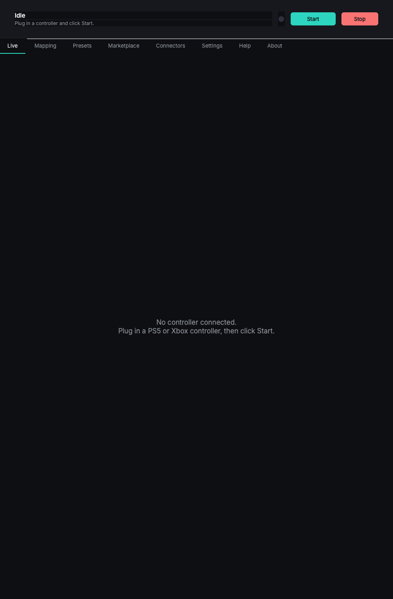

# Gamepad → MIDI Bridge

Turn a PS5 DualSense or Xbox controller into a MIDI controller. Cross-platform desktop app for VJs, music producers, and live performers.



## Features

**Free**
- Auto-calibrated sticks and triggers → MIDI on macOS, Linux, Windows
- Native virtual MIDI port on macOS (CoreMIDI) and Linux (ALSA)
- Auto-detects an existing loopMIDI port on Windows
- 0-config defaults: face buttons → notes, sticks → CCs, D-pad → notes
- Headless mode (`--headless`) for kiosks and touring rigs
- System tray / menu bar icon for background running
- Auto-rescan and pre-built connectors for **Resolume Arena**, **Ableton Live**, **TouchDesigner**, **VDMX**, **MadMapper**, **REAPER**

**Pro**
- DualSense adaptive trigger haptics (7 feel effects, USB + Bluetooth)
- Touchpad XY → MIDI CC (Kaoss Pad-style modulator, 1- or 2-finger)
- Stick edge quantizer — push to a corner to fire a note (4/8/16 sectors)
- Multi-controller (Pro) — daisy-chain two pads on separate MIDI channels
- OSC output alongside or instead of MIDI
- Custom mapping editor + preset library + marketplace publishing

## Run from source

```bash
python -m venv .venv
source .venv/bin/activate          # Windows: .venv\Scripts\activate
pip install -e ".[dev,build]"
gamepad-midi-bridge
```

Python 3.9+ required. PySide6 ships its own Qt runtime so no system Qt is needed.

## Build a distributable

```bash
python build.py                    # builds for the current OS into dist/
```

- **macOS** — `.app` bundle, 120 MB. Codesign + notarize separately for distribution.
- **Windows** — `.exe` folder, optionally wrapped by Inno Setup (`build/windows/installer.iss`)
- **Linux** — single-file binary + `.desktop` file in `build/linux/`

CI workflows in `.github/workflows/` build artifacts automatically on every tag push (`v*.*.*`) and attach them to a GitHub Release.

## CLI

```
gamepad-midi-bridge --help

  --version
  --headless              Run the bridge with no GUI
  --reset-config          Wipe config + opt-ins + onboarding flag
  --export-pack PATH      Bundle mapping + presets + license into .gmbpack
  --import-pack PATH      Apply a .gmbpack
  --log-path              Print log file location
  --debug                 Mirror logs to stderr
```

## Architecture (in two lines)

```
pygame-ce SDL2 input ─┐
                       ├─→ BridgeWorker (QThread) ─→ python-rtmidi ─→ virtual MIDI port ─→ DAW / VJ
parallel cython-hidapi ┘                          ╰─→ optional OscSender ─→ UDP ─→ Resolume / TouchDesigner
```

Multiple `BridgeWorker`s run in parallel for multi-controller mode. The GUI never blocks the inner loop — everything streams back through Qt signals.

Full docs in [`docs/`](docs/README.md): user manual, architecture, contributing, release checklist.

## Licensing

Pro features verify offline against an Ed25519-signed JSON blob (`src/gamepad_midi_bridge/license.py`). The matching private key lives only in `store.aidxn.com`'s Netlify env vars and is used by the Stripe webhook to sign per-purchase blobs delivered via Resend.

## Layout

```
src/gamepad_midi_bridge/
  bridge.py            engine (QThread)
  dualsense.py         raw HID (battery, touchpad, adaptive triggers, BT CRC32)
  mac_haptics.py       PyObjC GCController fallback for macOS triggers
  controller.py        pygame joystick wrapper
  corner_quantizer.py  stick edge → MIDI button math
  calibration.py       drift auto-calibration
  mapping.py           schema (v2) + serialisation
  midi_backend.py      python-rtmidi wrapper
  osc_backend.py       OSC 1.0 UDP sender
  license.py           Ed25519 offline verifier
  multi.py             1..2 BridgeController orchestrator
  telemetry.py         opt-in anonymous stats
  updater.py           opt-out auto-update check
  connectors/          host integrations (Resolume, Ableton, TD, VDMX, MadMapper, REAPER)
  ui/                  PySide6 widgets

build/                 per-OS packaging configs (Inno Setup, Info.plist, .desktop)
docs/                  user manual + architecture + contributing
scripts/               build wrapper, screenshot generator, license-issuer keygen
tests/                 pytest suite (47 tests)
```

## Status

V1 ships free + Pro tiers; commerce pipeline live at `store.aidxn.com` (Stripe Checkout → Netlify Function → Ed25519-signed license email via Resend). Marketplace + preset sharing wired into the in-app Marketplace tab.

See [CHANGELOG.md](CHANGELOG.md) for the full feature list.
